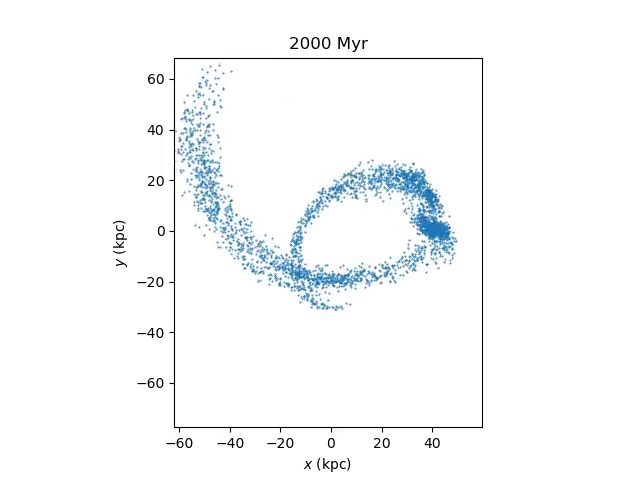

#  GravHopper

*"They told me computers could only do arithmetic." -- Grace Hopper*

**Gravitational N-body simulation code written by Jeremy Bailin.**

Named in honour of pioneering computer scientist Grace Hopper. Doubly appropriate
because it uses a leapfrog integrator.

This is a simple Python-interface code for performing gravitational N-body simulations. It combines a simple Python interface for ease of use with a C backend for speed, and has the following features:
 - Choice of Barnes-Hut tree or direct summation algorithm.
 - Ability to include external potentials from galpy, gala, or user-supplied functions.
 - Ability to return output as pynbody snapshots.
 - Functions that generate equilibrium or near-equilibrium initial conditions (ICs) for
    several density profiles (Plummer, Hernquist, exponential disk), along with the ability
    to create ICs from galpy distribution function objects or pynbody snapshots.
 - Utility functions for plotting snapshots and making movies.
 
For now, it uses a constant uniform timestep and constant uniform Plummer softening.

Requirements:
 - Astropy
 - NumPy, SciPy, Matplotlib
 - C compiler
 - To use [galpy](https://github.com/jobovy/galpy), [gala](http://gala.adrian.pw/en/latest/),
    or [pynbody](https://pynbody.github.io/pynbody/) interface functions, they will need to be installed.
 - Saving movies requires [ffmpeg](https://www.ffmpeg.org/).

For example, this will create a Plummer sphere with 2000 particles, run it for a few dynamical times,
and plot the particle positions before and after to show that it is in equilibrium:

    from gravhopper import Simulation, IC
    from astropy import units as u
    import matplotlib.pyplot as plt
    
    # Create Plummer initial conditions.
    Plummer_IC = IC.Plummer(N=2000, b=1*u.pc, totmass=1e6*u.Msun)
    
    # Create a new simulation with a time step of 0.005 Myr and a softening of 0.05 pc.
    sim = Simulation(dt=0.005*u.Myr, eps=0.05*u.pc)
    # Add the Plummer model to the simulation
    sim.add_IC(Plummer_IC)
    # Run for 400 time steps
    sim.run(400)
    
    # Plot the x-y positions at the beginning and end.
    fig = plt.figure(figsize=(12,4))
    ax1 = fig.add_subplot(121, aspect=1.0)
    ax2 = fig.add_subplot(122, aspect=1.0)
    sim.plot_particles(snap='IC', unit=u.pc, xlim=[-10,10], ylim=[-10,10], ax=ax1)
    sim.plot_particles(snap='final', unit=u.pc, xlim=[-10,10], ylim=[-10,10], ax=ax2)
    
To make a movie of the whole evolution of the simulation:
    
    # Make and save a movie of the simulation running
    sim.movie_particles('Plummer_sim.mp4', unit=u.pc, xlim=[-10,10], ylim=[-10,10])

## Documentation

Full documentation, including installation instructions, examples, and library reference,
are at [Read The Docs](https://gravhopper.readthedocs.io)

## Installation

### Option 1: Pip

If all goes well, you should be able to install GravHopper simply with:
```
pip install gravhopper
```


### Option 2: Install from source

To install directly from the current source:

1. Clone or download the git repository
```
git clone https://github.com/jbailinua/gravhopper.git
```
2. Go into the gravhopper directory and build the code.
```
cd gravhopper
python setup.py build_ext --inplace
```    
3. Copy the gravhopper subdirectory to wherever you want to use it.
