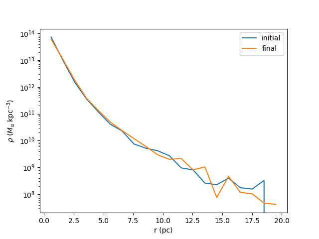
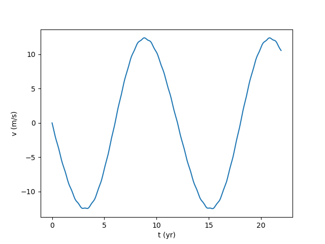
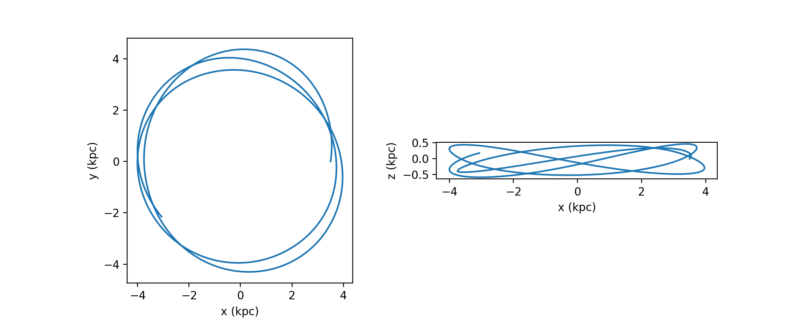
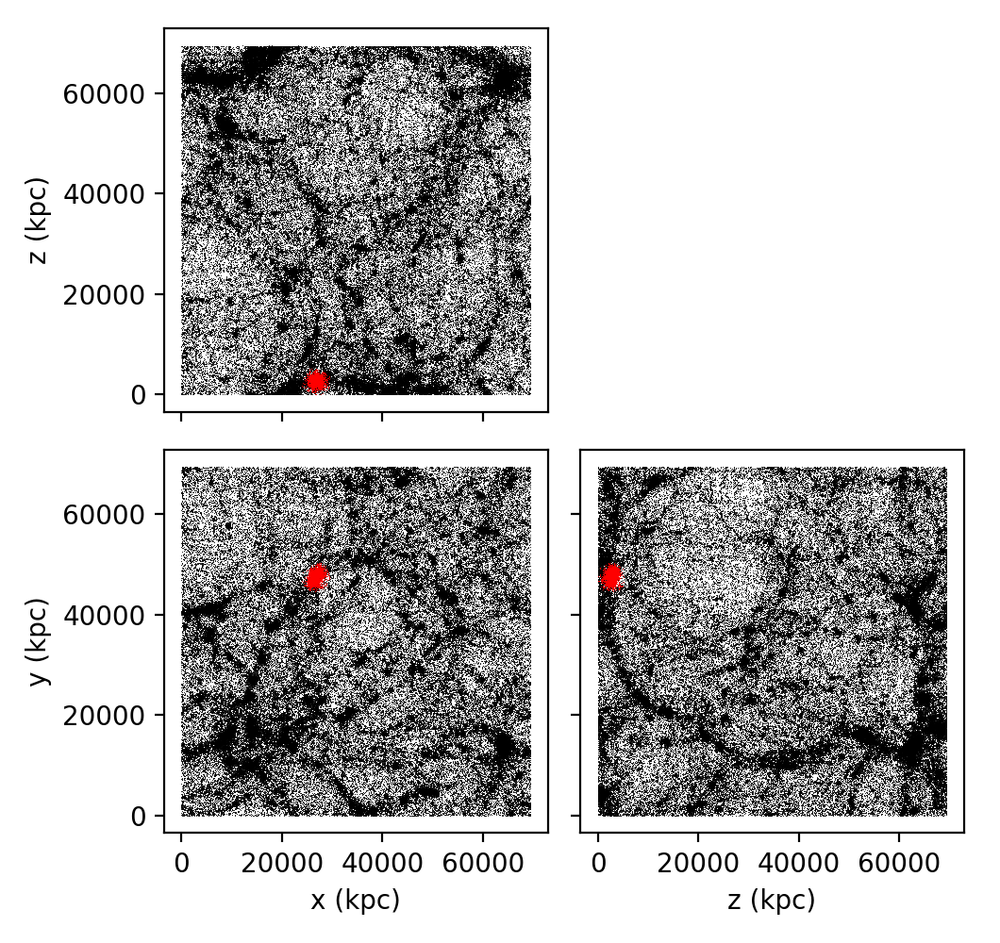

.. _examples:

Examples
========

#. :ref:`example_equilibrium_plummer`
#. :ref:`example_disrupting_satellite`
#. :ref:`example_solar_system`
#. :ref:`example_sample_galpy_df`
#. :ref:`example_disk_particle_orbit`
#. :ref:`example_galaxy_merger`
#. :ref:`example_cosmo_snapshot`

.. _example_equilibrium_plummer:

Equilibrium Plummer sphere
--------------------------

Create an equilibrium Plummer sphere. Evolve
for 2 Myr, and demonstrate that it stays in equilibrium by plotting before-and-after
density profiles and making a movie of the evolution::

    from gravhopper import Simulation, IC
    from astropy import units as u
    import matplotlib.pyplot as plt
    from pynbody.analysis.profile import Profile
        
    # Create and run the simulation
    sim = Simulation(dt=5e3*u.yr, eps=0.05*u.pc)
    Plummer_IC = IC.Plummer(N=5000, b=1*u.pc, totmass=1e6*u.Msun)
    sim.add_IC(Plummer_IC)
    sim.run(400)
    
    # Plot density profile before and after
    s_IC = sim.pyn_snap(timestep=0)   # Note this always puts length in kpc
    s_final = sim.pyn_snap()
    p_IC = Profile(s_IC, ndim=3, min=0.0001, max=0.02, nbins=20)
    p_final = Profile(s_final, ndim=3, min=0.0001, max=0.02, nbins=20)
    plt.plot(p_IC['rbins'].in_units('pc'), p_IC['density'], label='initial')
    plt.plot(p_final['rbins'].in_units('pc'), p_final['density'], label='final')
    plt.yscale('log')
    plt.xlabel('r (pc)')
    plt.ylabel(f'$\\rho$ (${p_IC["density"].units.latex()}$)')
    plt.legend()
    
    # Make a movie of the simulation
    sim.movie_particles('Plummer-equilibrium.mp4', unit=u.pc, xlim=[-5,5], ylim=[-5,5])

    
.. raw:: html

    <video controls src="_static/Plummer-equilibrium.mp4"></video>

.. _example_disrupting_satellite:

Satellite disrupting in an external halo potential
--------------------------------------------------

Create an equilibrium Hernquist sphere satellite. Put it in an external logarithmic potential on an elliptical orbit and make a movie of it getting tidally disrupted::

    from gravhopper import Simulation, IC
    from astropy import units as u
    from galpy.potential import LogarithmicHaloPotential
    
    # Create and run the simulation
    sim = Simulation(dt=5*u.Myr, eps=0.05*u.kpc)
    Hernquist_IC = IC.Hernquist(N=5000, a=1*u.kpc, totmass=1e9*u.Msun, 
        center_pos=[50,0,0]*u.kpc, center_vel=[0,100,0]*u.km/u.s)
    sim.add_IC(Hernquist_IC)
    externalpot = LogarithmicHaloPotential(amp=(200*u.km/u.s)**2)
    sim.add_external_force(externalpot)
    sim.run(400)
    
    # Make a movie of the simulation
    sim.movie_particles('satellite-stripping.mp4', timeformat='{0:.0f}')
    
.. raw:: html

    <video controls src="_static/satellite-stripping.mp4"></video>

    
.. _example_solar_system:

Reflex motion of the Sun due to Venus and Jupiter
-------------------------------------------------

Create a simple Solar System model with the Sun, Venus, and Jupiter. Evolve for about 2
Jovian years and plot the radial velocity of the Sun as seen by an observer in the
ecliptic::

    from gravhopper import Simulation
    from astropy import units as u
    import matplotlib.pyplot as plt
    
    # Create and run the simulation
    sim = Simulation(dt=10*u.day, eps=0.0001*u.au)
    Sun = {'pos':[0, 0, 0]*u.au, 'vel':[0, 0, 0]*u.km/u.s, 'mass':[1]*u.Msun}    
    Venus = {'pos':[0,107.5e6, 0]*u.km, 'vel':[-35.23, 0, 0]*u.km/u.s, 'mass':[4.87e24]*u.kg}
    Jupiter = {'pos':[-816.6e6,0,0]*u.km, 'vel':[0,-12.49,0]*u.km/u.s, 'mass':[1898e24]*u.kg}
    sim.add_IC(Sun)
    sim.add_IC(Venus)
    sim.add_IC(Jupiter)
    sim.run(800)
    
    # Plot the Sun's x velocity.
    plt.plot(sim.times.to(u.yr), sim.velocities[:,0,0].to(u.m/u.s))
    plt.xlabel('t (yr)')
    plt.ylabel('v (m/s)')
        

.. _example_sample_galpy_df:

Sample a galpy NFW spherical distribution function
--------------------------------------------------

Create a ``galpy`` NFW distribution function and sample it to create a set of
equilibrium initial conditions. Demonstrate that it stays in equilibrium by making a movie of the evolution::

    from gravhopper import Simulation, IC
    from astropy import units as u
    from galpy import potential, df
    import matplotlib.pyplot as plt

    # Set up useful constants
    ro = 8. # galpy unit system
    vo = 220. # more galpy unit system
    rmax = 0.5*u.Mpc
    rmax_over_ro = (rmax/(ro*u.kpc)).to(1).value
    Nhalo = 5000

    # Create the distribution function object and IC from it
    NFWpot = potential.NFWPotential(amp=2e11*u.Msun, a=20*u.kpc)
    NFWmass = potential.mass(NFWpot, rmax)
    potential.turn_physical_off(NFWpot)
    NFWdf = df.isotropicNFWdf(pot=NFWpot, rmax=rmax_over_ro)
    NFW_IC = IC.from_galpy_df(NFWdf, N=Nhalo, totmass=NFWmass)

    # Create and run the simulation
    sim = Simulation(dt=10*u.Myr, eps=1*u.kpc)
    sim.add_IC(NFW_IC)
    sim.run(400)

    # Convert time to Gyr and make a movie
    sim.times = sim.times.to(u.Gyr)
    sim.movie_particles('NFWdf.mp4', timeformat='{0:.2f}', xlim=[-200,200], ylim=[-200,200])
    
.. raw:: html

    <video controls src="_static/NFWdf.mp4"></video>

.. _example_disk_particle_orbit:

Bobbing and oscillating orbit in a galactic disk
------------------------------------------------

Create an exponential disk in an external NFW potential. Follow the orbit of a particle
that is in a not-quite-circular orbit for a few orbital timescales::

    from gravhopper import Simulation, IC
    from astropy import units as u
    from galpy import potential
    import matplotlib.pyplot as plt
    
    # Set up an external NFW potential and an exponential disk that uses its rotation curve
    NFWpot = potential.NFWPotential(amp=2e11*u.Msun, a=20*u.kpc)
    potential.turn_physical_on(NFWpot)
    expdisk_IC = IC.expdisk(N=5000, sigma0=100*u.Msun/u.pc**2, Rd=2*u.kpc, z0=0.2*u.kpc, sigmaR_Rd=20*u.km/u.s,
        external_rotcurve=NFWpot.vcirc)
    # Create a tracer particle to be particle 0
    particle = {'pos':[3.5,0,0]*u.kpc, 'vel':[10,70,10]*u.km/u.s, 'mass':[1]*u.Msun}
        
    # Create and run the simulation
    sim = Simulation(dt=2*u.Myr, eps=0.1*u.kpc)
    sim.add_IC(particle)
    sim.add_IC(expdisk_IC)
    sim.add_external_force(NFWpot)
    sim.run(500)
    
    # Plot the xy and xz trajectories of the tracer particle
    fig = plt.figure(figsize=(10,4))
    ax_xy = fig.add_subplot(121, aspect=1.0)
    ax_xz = fig.add_subplot(122, aspect=1.0)
    ax_xy.plot(sim.positions[:,0,0], sim.positions[:,0,1])
    ax_xz.plot(sim.positions[:,0,0], sim.positions[:,0,2])
    ax_xy.set_xlabel('x (kpc)')
    ax_xy.set_ylabel('y (kpc)')
    ax_xz.set_xlabel('x (kpc)')
    ax_xz.set_ylabel('z (kpc)')    

.. _example_galaxy_merger:

Galaxy merger
-------------

Create two exponential disks with truncated isothermal halos, offset and tilted, and make a movie
of just the disk particles and just the dark matter particles. Note that this one takes
longer because it has over 40,000 particles, compared to <5,000 in the other examples.
This is required to keep the dark matter and disk particles of similar mass; otherwise,
there is significant amounts of two body scattering that destroys the disks::

    from gravhopper import Simulation, IC
    from astropy import units as u, constants as const
    from galpy import potential
    
    # Create a disk and TSIS sampled halo
    galaxy1_pos = [-50,0,0]*u.kpc
    galaxy1_vel = [25,0,50]*u.km/u.s
    galaxy2_pos = -galaxy1_pos
    galaxy2_vel = -galaxy1_vel
    Nhalo = 20000
    Ndisk = 1000
    
    vhalo = 150*u.km/u.s
    rhalo = 100*u.kpc
    Mhalo = (vhalo**2 * rhalo / const.G).to(u.Msun)  # about 5e11 Msun
    # Galaxy 1
    halo1 = IC.TSIS(N=Nhalo, totmass=Mhalo, maxrad=rhalo, center_pos=galaxy1_pos, center_vel=galaxy1_vel)
    disk1 = IC.expdisk(N=Ndisk, sigma0=200*u.Msun/u.pc**2, Rd=2*u.kpc, z0=0.2*u.kpc, sigmaR_Rd=20*u.km/u.s,
        external_rotcurve=lambda x: vhalo, center_pos=galaxy1_pos, center_vel=galaxy1_vel)
    # Galaxy 2
    halo2 = IC.TSIS(N=Nhalo, totmass=Mhalo, maxrad=rhalo, center_pos=galaxy2_pos, center_vel=galaxy2_vel)
    # For the disk, create it at the origin and then flip it on its side before setting
    # its position and velocity
    disk2 = IC.expdisk(N=Ndisk, sigma0=200*u.Msun/u.pc**2, Rd=2*u.kpc, z0=0.2*u.kpc, sigmaR_Rd=20*u.km/u.s,
        external_rotcurve=lambda x: vhalo)
    disk2['pos'][:,[0,1,2]] = disk2['pos'][:,[2,1,0]] + galaxy2_pos
    disk2['vel'][:,[0,1,2]] = disk2['vel'][:,[2,1,0]] + galaxy2_vel
    
    # Create simulation and add the galaxies. Put all halo particles first and all
    # disk particles afterwards so each has a distinct particle id range
    sim = Simulation(dt=4*u.Myr, eps=0.1*u.kpc)
    sim.add_IC(halo1)
    sim.add_IC(halo2)
    sim.add_IC(disk1)
    sim.add_IC(disk2)
    sim.run(600)
    
    # Movie of dark matter halos
    sim.movie_particles('example-merger-dm.mp4', coords='xz', particle_range=[0,2*Nhalo], color='black',
        xlim=[-75,75], ylim=[-75,75], timeformat='Dark Matter {0:.0f}')
    # Movie of disks
    sim.movie_particles('example-merger-disks.mp4', coords='xz', particle_range=[2*Nhalo,2*Nhalo+2*Ndisk],
        xlim=[-75,75], ylim=[-75,75], timeformat='Baryons {0:.0f}')
  
.. raw:: html

    <video controls src="_static/example-merger-dm.mp4"></video>

    <video controls src="_static/example-merger-disks.mp4"></video>

      
      
.. _example_cosmo_snapshot:

Initial conditions from cosmological simulation output
------------------------------------------------------

Read in the final snapshot of a GADGET cosmological simulation using ``pynbody``. Select a
halo from it, and use that halo as the initial conditions for a non-cosmological 
GravHopper simulation.

First download the :download:`cosmological simulation snapshot <_static/cosmo-snapshot_020>`::

    from gravhopper import Simulation, IC
    from astropy import units as u
    import matplotlib.pyplot as plt
    import pynbody
    
    # Read in cosmological simulation snapshot, convert to kpc units
    cosmo = pynbody.load('cosmo-snapshot_020')
    cosmo.physical_units()
    
    # Pick out the halo we want
    halo_center = [26750, 47500, 2600]
    halo_rad = 3000
    halo = cosmo[pynbody.filt.Sphere(halo_rad, halo_center)]

    # Plot the original simulation and highlight the halo
    fig = plt.figure(figsize=(5.3,5))
    ax_xy = fig.add_subplot(223, aspect=1.0)
    ax_xz = fig.add_subplot(221, aspect=1.0)
    ax_yz = fig.add_subplot(224, aspect=1.0)
    ax_xy.scatter(cosmo['pos'][:,0], cosmo['pos'][:,1], s=0.1, lw=0, color='black')
    ax_xy.scatter(halo['pos'][:,0], halo['pos'][:,1], s=0.1, lw=0, color='red')
    ax_xz.scatter(cosmo['pos'][:,0], cosmo['pos'][:,2], s=0.1, lw=0, color='black')
    ax_xz.scatter(halo['pos'][:,0], halo['pos'][:,2], s=0.1, lw=0, color='red')
    ax_yz.scatter(cosmo['pos'][:,2], cosmo['pos'][:,1], s=0.1, lw=0, color='black')
    ax_yz.scatter(halo['pos'][:,2], halo['pos'][:,1], s=0.1, lw=0, color='red')
    ax_xy.set_xlabel('x (kpc)')
    ax_xy.set_ylabel('y (kpc)')
    ax_xz.set_xticklabels([])
    ax_xz.set_ylabel('z (kpc)')
    ax_yz.set_xlabel('z (kpc)')
    ax_yz.set_yticklabels([])
    plt.tight_layout()
    
    # Create a simulation with this halo as IC and run
    sim = Simulation(dt=20*u.Myr, eps=50*u.kpc)
    halo_IC = IC.from_pyn_snap(halo)
    sim.add_IC(halo_IC)
    sim.run(200)
    
    # Make movie. Put lengths in Mpc and units in Gyr first
    sim.positions = sim.positions.to(u.Mpc)
    sim.times = sim.times.to(u.Gyr)
    sim.movie_particles('cosmo-halo.mp4', timeformat='{0:.2f}')
   

.. raw:: html

    <video controls src="_static/cosmo-halo.mp4"></video>

    